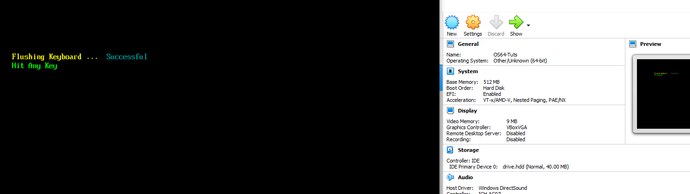
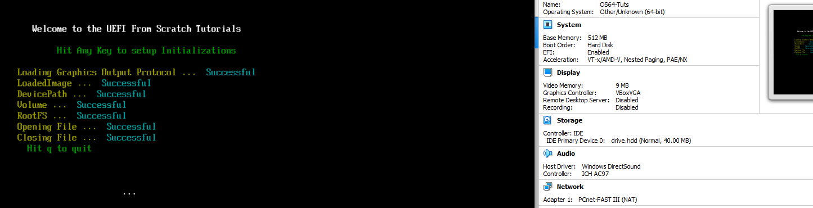
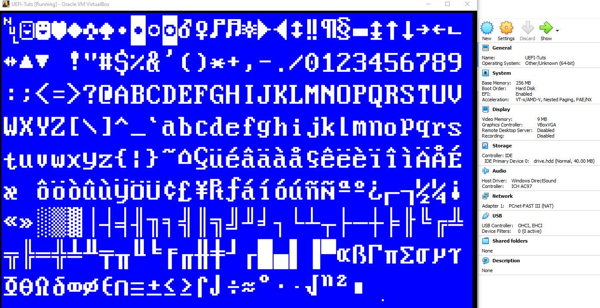

# Step by Step Tutorials on how to use the UEFI for OS Development from scratch

# NOTES  
- THE TUTORIALS ON YOUTUBE ARE WINDOWS BASED, BUT CODE SHOULD WORK IN LINUX AND MAC. 

- **UEFI 2.9 Specs PDF** : https://uefi.org/specifications  

- The create image is there for your convenience. I include the EXE and source code to create your own drive.hdd file from scratch. It even has the code setup with a 40 Meg GPT/EFI partition. This way you can see how it works.  

# BUILD INSTRCUTIONS  
[https://github.com/ThatOSDev/UEFI-Tuts/tree/master/BUILD.md](https://github.com/ThatOSDev/UEFI-Tuts/tree/master/BUILD.md)  

# SOCIAL MEDIA LINKS
**DISCORD** : https://discord.gg/6gxEF3QCtB  
**YOUTUBE** : https://www.youtube.com/channel/UCouyC9D6WFBwc24sqdkS-jw  

# READ THIS !!!
- **BEGINNER MISTAKES** : [https://wiki.osdev.org/Beginner_Mistakes](https://wiki.osdev.org/Beginner_Mistakes)  

# TUTORIALS
-  Working on this now.....  
    - TEXT                                             --- [YOUTUBE  3](https://www.youtube.com/watch?v=vo1Q2th7l3I)  ---  [SOURCE CODE](https://github.com/ThatOSDev/UEFI-Tuts/tree/master/src/tutorial%201)  
    - COLOR                                            --- [YOUTUBE  5](https://www.youtube.com/watch?v=MlJCHIgGj4g)  ---  [SOURCE CODE](https://github.com/ThatOSDev/UEFI-Tuts/tree/master/src/tutorial%202)  
    - KEYBOARD                                         --- [YOUTUBE  6](https://www.youtube.com/watch?v=27xFmX0RK8s)  ---  [SOURCE CODE](https://github.com/ThatOSDev/UEFI-Tuts/tree/master/src/tutorial%203)  
    - ERROR CHECKING                                   --- [YOUTUBE  7](https://www.youtube.com/watch?v=lLb_Chaf8zk)  ---  [SOURCE CODE](https://github.com/ThatOSDev/UEFI-Tuts/tree/master/src/tutorial%204)  
    - EFILIBS                                          --- [YOUTUBE  8](https://www.youtube.com/watch?v=6YN18i6Ws18)  ---  [SOURCE CODE](https://github.com/ThatOSDev/UEFI-Tuts/tree/master/src/tutorial%205) 
    - CURSOR POSITIONS                                 --- [YOUTUBE 10](https://www.youtube.com/watch?v=H-pzGdDZDKA)  ---  [SOURCE CODE](https://github.com/ThatOSDev/UEFI-Tuts/tree/master/src/tutorial%206) 
    - GRAPHICS OUTPUT 1                                --- [YOUTUBE 11](https://www.youtube.com/watch?v=eypFh_k86BM)  ---  [SOURCE CODE](https://github.com/ThatOSDev/UEFI-Tuts/tree/master/src/tutorial%207)
    - EFI STALL / DELAY                                --- [YOUTUBE 12](https://www.youtube.com/watch?v=hMTGmX4_mUY)  ---  [SOURCE CODE](https://github.com/ThatOSDev/UEFI-Tuts/tree/master/src/tutorial%208)    
    - COLD REBOOT / SHUTDOWN                           --- [YOUTUBE 13](https://www.youtube.com/watch?v=JXxgnGzUFqQ)  ---  [SOURCE CODE](https://github.com/ThatOSDev/UEFI-Tuts/tree/master/src/tutorial%209)  
    - UNICODE KeyStroke ( UnicodeChar )                --- [YOUTUBE 14](https://www.youtube.com/watch?v=a4NJCuvfaPc)  ---  [SOURCE CODE](https://github.com/ThatOSDev/UEFI-Tuts/tree/master/src/tutorial%2010)
    - LOAD / OPEN / CLOSE VOLUME + FILE SYSTEM + FILES --- [YOUTUBE 15](https://www.youtube.com/watch?v=Zgiyy0Ysh08)  ---  [SOURCE CODE](https://github.com/ThatOSDev/UEFI-Tuts/tree/master/src/tutorial%2011)  
    - LOADED FILE TO BUFFER + READING IT               --- [YOUTUBE 16](https://www.youtube.com/watch?v=rgDN0kTP-fY)  ---  [SOURCE CODE](https://github.com/ThatOSDev/UEFI-Tuts/tree/master/src/tutorial%2012)
    - CUSTOM FONT                                      --- YOUTUBE COMING SOON  ---  [SOURCE CODE](https://github.com/ThatOSDev/UEFI-Tuts/tree/master/src/tutorial%2013)

More Tuts Coming soon... ( **NOTE : The order of this list is subject to change** )  

    * Print String ( With our new font )  
    * Change Resolution  
    * Transfer to test Kernel   
    * Graphics BackBuffer  
    * Image Loading ( BMP, TGA )  
    * PCI  

  

  

  
