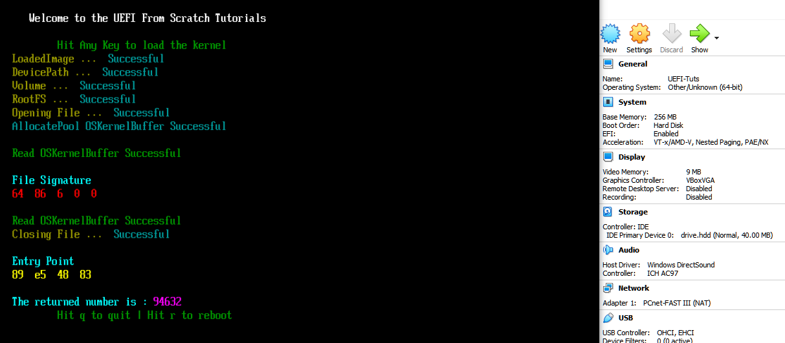

# Step by Step Tutorials on how to use the UEFI for OS Development from scratch

# NOTES  
- THE TUTORIALS ON YOUTUBE ARE WINDOWS BASED, BUT CODE SHOULD WORK IN LINUX AND MAC. 

- **UEFI 2.9 Specs PDF** : https://uefi.org/specifications  

- **WARNING** : The 40 meg file is still there, but for MAC users, the 256 meg file is in the ZIP inside of the HOLD folder. Windows users CAN use that size file too.  

- **The IMAGECREATOR program has been removed.**  

# BUILD INSTRCUTIONS  
[https://github.com/ThatOSDev/UEFI-Tuts/tree/master/BUILD.md](https://github.com/ThatOSDev/UEFI-Tuts/tree/master/BUILD.md)  

# SOCIAL MEDIA LINKS
**DISCORD** : https://discord.gg/6gxEF3QCtB  
**YOUTUBE** : https://www.youtube.com/channel/UCouyC9D6WFBwc24sqdkS-jw  

# READ THIS !!!
- THINGS YOU SHOULD KNOW BEFORE STARTING OS DEVELOPMENT  
    - The C Language  
    - Assembly Language  
    - How to read Hex Code ( Example : 0x8664 )  
    - How your Host Operating System works ( Such as windows or linux )  
    - How your compiler works ( Such as GCC )  
    - How to do research ( Don't be lazy )  
- **BEGINNER MISTAKES** : [https://wiki.osdev.org/Beginner_Mistakes](https://wiki.osdev.org/Beginner_Mistakes)  

# TUTORIALS
- RIGHT CLICK THE LINKS AND OPEN IN NEW TAB  
    - TEXT &nbsp; &nbsp; &nbsp; &nbsp; &nbsp;&nbsp; &nbsp; &nbsp; &nbsp; &nbsp; &nbsp; &nbsp; &nbsp; &nbsp; &nbsp; &nbsp; &nbsp; &nbsp; &nbsp; &nbsp; &nbsp; &nbsp; &nbsp;&nbsp; &nbsp; &nbsp; &nbsp; &nbsp; &nbsp; &nbsp; &nbsp; &nbsp; &nbsp; &nbsp; &nbsp; &nbsp; &nbsp; &nbsp; &nbsp; &nbsp; &nbsp; &nbsp; &nbsp; --- [YOUTUBE&nbsp;&nbsp; 3](https://www.youtube.com/watch?v=vo1Q2th7l3I)  ---  [SOURCE CODE](https://github.com/ThatOSDev/UEFI-Tuts/tree/master/src/tutorial%201)  
    - COLOR &nbsp; &nbsp; &nbsp;&nbsp; &nbsp; &nbsp; &nbsp; &nbsp; &nbsp; &nbsp; &nbsp; &nbsp; &nbsp; &nbsp; &nbsp; &nbsp; &nbsp; &nbsp; &nbsp; &nbsp; &nbsp;&nbsp; &nbsp; &nbsp; &nbsp; &nbsp; &nbsp; &nbsp; &nbsp; &nbsp; &nbsp; &nbsp; &nbsp; &nbsp; &nbsp; &nbsp; &nbsp; &nbsp; &nbsp; &nbsp; &nbsp; --- [YOUTUBE&nbsp;&nbsp; 5](https://www.youtube.com/watch?v=MlJCHIgGj4g)  ---  [SOURCE CODE](https://github.com/ThatOSDev/UEFI-Tuts/tree/master/src/tutorial%202)  
    - KEYBOARD &nbsp; &nbsp; &nbsp; &nbsp; &nbsp; &nbsp; &nbsp; &nbsp; &nbsp; &nbsp; &nbsp; &nbsp; &nbsp; &nbsp; &nbsp; &nbsp; &nbsp; &nbsp;&nbsp; &nbsp; &nbsp; &nbsp; &nbsp; &nbsp; &nbsp; &nbsp; &nbsp; &nbsp; &nbsp; &nbsp;&nbsp; &nbsp; &nbsp; &nbsp; &nbsp; &nbsp; &nbsp; &nbsp; --- [YOUTUBE&nbsp;&nbsp; 6](https://www.youtube.com/watch?v=27xFmX0RK8s)  ---  [SOURCE CODE](https://github.com/ThatOSDev/UEFI-Tuts/tree/master/src/tutorial%203)  
    - ERROR CHECKING &nbsp; &nbsp;&nbsp; &nbsp; &nbsp; &nbsp; &nbsp; &nbsp; &nbsp; &nbsp; &nbsp; &nbsp; &nbsp; &nbsp; &nbsp; &nbsp; &nbsp; &nbsp; &nbsp; &nbsp; &nbsp; &nbsp; &nbsp; &nbsp; &nbsp; &nbsp; &nbsp; &nbsp; &nbsp; &nbsp;&nbsp; &nbsp; --- [YOUTUBE&nbsp;&nbsp; 7](https://www.youtube.com/watch?v=lLb_Chaf8zk)  ---  [SOURCE CODE](https://github.com/ThatOSDev/UEFI-Tuts/tree/master/src/tutorial%204)  
    - EFILIBS &nbsp; &nbsp; &nbsp; &nbsp; &nbsp; &nbsp; &nbsp; &nbsp; &nbsp; &nbsp; &nbsp; &nbsp; &nbsp; &nbsp; &nbsp; &nbsp; &nbsp; &nbsp; &nbsp; &nbsp; &nbsp; &nbsp; &nbsp; &nbsp; &nbsp; &nbsp; &nbsp; &nbsp; &nbsp; &nbsp; &nbsp; &nbsp; &nbsp; &nbsp; &nbsp; &nbsp; &nbsp; &nbsp; &nbsp; &nbsp; --- [YOUTUBE&nbsp;&nbsp; 8](https://www.youtube.com/watch?v=6YN18i6Ws18)  ---  [SOURCE CODE](https://github.com/ThatOSDev/UEFI-Tuts/tree/master/src/tutorial%205) 
    - CURSOR POSITIONS &nbsp; &nbsp; &nbsp; &nbsp; &nbsp; &nbsp; &nbsp; &nbsp; &nbsp; &nbsp; &nbsp; &nbsp; &nbsp; &nbsp; &nbsp; &nbsp; &nbsp; &nbsp; &nbsp; &nbsp; &nbsp; &nbsp; &nbsp; &nbsp; &nbsp; &nbsp; &nbsp; &nbsp; &nbsp; --- [YOUTUBE 10](https://www.youtube.com/watch?v=H-pzGdDZDKA)  ---  [SOURCE CODE](https://github.com/ThatOSDev/UEFI-Tuts/tree/master/src/tutorial%206) 
    - GRAPHICS OUTPUT 1 &nbsp; &nbsp; &nbsp; &nbsp; &nbsp; &nbsp; &nbsp; &nbsp; &nbsp; &nbsp; &nbsp; &nbsp; &nbsp; &nbsp; &nbsp; &nbsp; &nbsp; &nbsp; &nbsp; &nbsp; &nbsp; &nbsp; &nbsp; &nbsp; &nbsp; &nbsp; &nbsp; &nbsp; --- [YOUTUBE 11](https://www.youtube.com/watch?v=eypFh_k86BM)  ---  [SOURCE CODE](https://github.com/ThatOSDev/UEFI-Tuts/tree/master/src/tutorial%207)
    - EFI STALL / DELAY &nbsp; &nbsp; &nbsp; &nbsp; &nbsp; &nbsp; &nbsp; &nbsp; &nbsp; &nbsp; &nbsp; &nbsp; &nbsp; &nbsp; &nbsp; &nbsp; &nbsp; &nbsp; &nbsp; &nbsp; &nbsp; &nbsp; &nbsp; &nbsp; &nbsp; &nbsp; &nbsp; &nbsp; &nbsp; &nbsp; &nbsp; --- [YOUTUBE 12](https://www.youtube.com/watch?v=hMTGmX4_mUY)  ---  [SOURCE CODE](https://github.com/ThatOSDev/UEFI-Tuts/tree/master/src/tutorial%208)    
    - COLD REBOOT / SHUTDOWN &nbsp;&nbsp;&nbsp; &nbsp;&nbsp; &nbsp; &nbsp; &nbsp; &nbsp; &nbsp; &nbsp; &nbsp; &nbsp; &nbsp; &nbsp; &nbsp; &nbsp; &nbsp; &nbsp; &nbsp; &nbsp; &nbsp; &nbsp; --- [YOUTUBE 13](https://www.youtube.com/watch?v=JXxgnGzUFqQ)  ---  [SOURCE CODE](https://github.com/ThatOSDev/UEFI-Tuts/tree/master/src/tutorial%209)  
    - UNICODE KeyStroke ( UnicodeChar ) &nbsp; &nbsp; &nbsp; &nbsp; &nbsp; &nbsp; &nbsp; &nbsp; &nbsp; &nbsp; &nbsp; &nbsp; &nbsp; &nbsp; &nbsp; &nbsp; --- [YOUTUBE 14](https://www.youtube.com/watch?v=a4NJCuvfaPc)  ---  [SOURCE CODE](https://github.com/ThatOSDev/UEFI-Tuts/tree/master/src/tutorial%2010)
    - LOAD / OPEN / CLOSE VOLUME + FILE SYSTEM + FILES &nbsp; --- [YOUTUBE 15](https://www.youtube.com/watch?v=Zgiyy0Ysh08)  ---  [SOURCE CODE](https://github.com/ThatOSDev/UEFI-Tuts/tree/master/src/tutorial%2011)  
    - LOADED FILE TO BUFFER + READING IT &nbsp; &nbsp;&nbsp; &nbsp; &nbsp; &nbsp; &nbsp; &nbsp; &nbsp; &nbsp; &nbsp; &nbsp; &nbsp; &nbsp; --- [YOUTUBE 16](https://www.youtube.com/watch?v=rgDN0kTP-fY)  ---  [SOURCE CODE](https://github.com/ThatOSDev/UEFI-Tuts/tree/master/src/tutorial%2012)
    - CUSTOM FONT &nbsp; &nbsp; &nbsp; &nbsp; &nbsp; &nbsp; &nbsp; &nbsp; &nbsp; &nbsp; &nbsp; &nbsp; &nbsp; &nbsp; &nbsp; &nbsp; &nbsp; &nbsp; &nbsp; &nbsp; &nbsp; &nbsp; &nbsp; &nbsp; &nbsp; &nbsp; &nbsp; &nbsp; &nbsp; &nbsp; &nbsp; &nbsp; &nbsp;--- [YOUTUBE 17](https://www.youtube.com/watch?v=9YGmVDYyEVw)  ---  [SOURCE CODE](https://github.com/ThatOSDev/UEFI-Tuts/tree/master/src/tutorial%2013)
	- RETURN VALUE FROM KERNEL &nbsp; &nbsp; &nbsp; &nbsp; &nbsp; &nbsp; &nbsp; &nbsp; &nbsp; &nbsp; &nbsp; &nbsp; &nbsp; &nbsp; &nbsp; &nbsp; &nbsp; &nbsp; &nbsp; &nbsp; &nbsp; &nbsp;--- [YOUTUBE 18](COMING SOON...)  ---  [SOURCE CODE](https://github.com/ThatOSDev/UEFI-Tuts/tree/master/src/tutorial%2014)

More Tuts Coming soon... ( **NOTE : The order of this list is subject to change** )  

    * Print String ( With our new font )  
    * Change Resolution  
    * Transfer to test Kernel and Exit Boot Services  
    * Memmap ( Memory Management - This might end up being two parts )
    * Graphics Output 2 
    * PCI  

  

  

  

  

